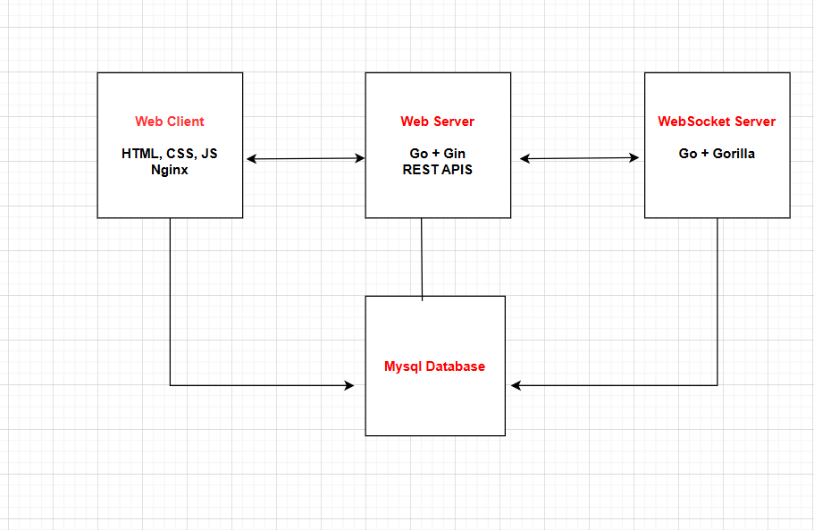

# Real-Time Chat Application

A production-ready real-time messaging platform built with Go, MySQL, and WebSockets. Features secure authentication, direct messaging, broadcast capabilities, and media sharing with a clean, responsive web interface.

## Architecture Overview

### System Design



### Component Breakdown

**Web Server (REST API)**
- JWT-based authentication
- Message CRUD operations
- Media upload/serving
- User management
- CORS middleware

**WebSocket Server**
- Real-time message delivery
- Connection management
- Message broadcasting
- JWT token validation

**Database Layer**
- Relational message storage
- User management
- Message recipients tracking
- Optimized queries with indexing

**Frontend Client**
- Responsive SPA interface
- Real-time WebSocket integration
- File upload capabilities
- Message history & filtering

## Tech Stack

### Backend
- **Language**: Go 1.21+
- **Framework**: Gin (HTTP router)
- **Database**: MySQL 8.0
- **Authentication**: JWT (golang-jwt/jwt/v5)
- **WebSockets**: Gorilla WebSocket
- **Password Hashing**: bcrypt
- **Containerization**: Docker & Docker Compose

### Frontend
- **Core**: Vanilla JavaScript (ES6+)
- **Styling**: CSS3 with Flexbox/Grid
- **HTTP Client**: Fetch API
- **WebSocket**: Native WebSocket API
- **Web Server**: Nginx

### Infrastructure
- **Reverse Proxy**: Nginx
- **Database**: MySQL with persistent volumes
- **Container Orchestration**: Docker Compose
- **Development**: Hot reload support

## Prerequisites

- Docker & Docker Compose
- Git
- 8GB+ available RAM
- Ports 3000, 8080, 8081, 3306 available

## Setup Instructions

### 1. Clone & Navigate
```bash
git clone https://github.com/Hadeer-Elsaeed/chatting-app.git
cd chatting-app
```

### 2. Environment Configuration
```bash
Optional: Customize database credentials in docker-compose.yml
Default credentials:
- Database: chatapp
- User: user
- Password: root
```

### 3. Start Services
```bash
docker-compose up
```

### 4. Verify Installation
```bash
# Check service health
curl http://localhost:8080/health

# Expected response:
# {"success":true,"message":"Server is running"}
```

### 5. Access Application
- **Frontend**: http://localhost:3000
- **API Docs**: http://localhost:8080/api
- **Health Check**: http://localhost:8080/health

## API Documentation

### Authentication Endpoints

#### Register User
```http
POST /api/auth/register
Content-Type: application/json

{
  "username": "john_doe",
  "email": "john@example.com", 
  "password": "SecurePass123!"
}
```

#### Login
```http
POST /api/auth/login
Content-Type: application/json

{
  "email": "john@example.com",
  "password": "SecurePass123!"
}

Response:
{
  "success": true,
  "data": {
    "token": "eyJhbGciOiJIUzI1NiIs...",
    "user": {
      "id": 1,
      "username": "john_doe",
      "email": "john@example.com"
    }
  }
}
```

### Protected Endpoints
*All protected endpoints require Authorization header: `Bearer <token>`*

#### Get User Profile
```http
GET /api/profile
Authorization: Bearer <token>
```

#### Get All Users
```http
GET /api/users
Authorization: Bearer <token>
```

#### Send Message
```http
POST /api/messages
Authorization: Bearer <token>
Content-Type: application/json

{
  "content": "Hello everyone!",
  "message_type": "broadcast", // or "direct"
  "recipients": [2, 3], // required for direct messages
  "media_url": "", // optional
  "media_type": "" // optional
}
```

#### Get Message History
```http
GET /api/messages?type=broadcast&page=1&limit=50
Authorization: Bearer <token>

Query Parameters:
- type: "direct" | "broadcast" | "" (all)
- page: pagination page (default: 1)
- limit: messages per page (default: 50, max: 100)
```

#### Get Conversation
```http
GET /api/conversations/{user_id}?page=1&limit=50
Authorization: Bearer <token>
```

#### Mark Messages as Read
```http
PUT /api/messages/read?message_ids=1,2,3
Authorization: Bearer <token>
```

#### Upload Media
```http
POST /api/media/upload
Authorization: Bearer <token>
Content-Type: multipart/form-data

file: <image/video file>
```

#### Get User Media
```http
GET /api/media
Authorization: Bearer <token>
```

#### Serve Media Files
```http
GET /api/media/{user_dir}/{filename}
```

### WebSocket Connection
```javascript
// Connect to WebSocket server with JWT authentication
const token = localStorage.getItem('token');
const ws = new WebSocket(`ws://localhost:8081/ws?token=${token}`);

ws.onopen = function() {
  console.log('Connected to WebSocket server');
};

ws.onmessage = function(event) {
  const message = JSON.parse(event.data);
  console.log('Received:', message);
};

ws.onerror = function(error) {
  console.error('WebSocket error:', error);
};

// Send message through WebSocket
ws.send(JSON.stringify({
  type: 'message',
  content: 'Hello WebSocket!',
  message_type: 'broadcast', // or 'direct'
  recipients: [2, 3] // required for direct messages
}));
```

#### WebSocket Message Format
**Incoming Message:**
```json
{
  "type": "message",
  "data": {
    "id": 1,
    "content": "Hello!",
    "sender_username": "john_doe",
    "sender_id": 1,
    "message_type": "broadcast",
    "recipients": [],
    "created_at": "2025-08-14T21:00:00Z",
    "media_url": "",
    "media_type": ""
  }
}
```

**Authentication:** JWT token required via query parameter `?token=<jwt_token>`

## Testing

### Unit Tests
```bash
cd test
go test -v

```

### Database Schema
```sql
users (id, username, email, password_hash, created_at)
messages (id, sender_id, content, message_type, media_url, created_at)
message_recipients (id, message_id, recipient_id, is_read, read_at)
```

### Environment Variables
```bash
# Database
DB_HOST=mysql
DB_PORT=3306
DB_USER=user
DB_PASSWORD=root
DB_NAME=chatapp

# Application
PORT=8080
WEBSOCKET_SERVER_URL=http://websocket-server:8081
UPLOAD_DIR=/app/uploads
RATE_LIMIT_MAX_REQUESTS=30
RATE_LIMIT_WINDOW_MINUTES=1
```
